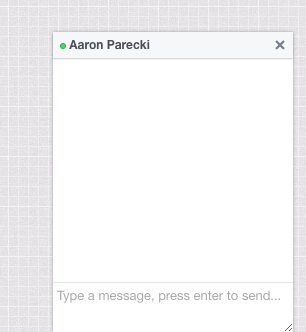

# Simple Chat Widget

This is a simple chat widget for your website. When you are online, website visitors will see a chat icon in the lower left corner of the screen, and clicking it will reveal a chat interface they can type into. Messages are routed to IRC, where you'll be able to respond.


When a guest clicks the chat button, the IRC bot will create a new channel and invite you to it, as well as announce the new guest in the admin channel.

> aaronpk: New guest joined #apk_030af544 From https://example.com/ 127.0.0.1 (Mozilla/5.0 (Macintosh; Intel Mac OS X 10_12_1) AppleWebKit/537.36 (KHTML, like Gecko) Chrome/56.0.2924.87 Safari/537.36)



Any message you type in the new channel will be sent to this guest, and anything the guest types in the window will be sent to the channel.

## Setup

### IRC Server

First you'll need to set up a private IRC server to use. I don't recommend using this on a public IRC server. I like [ngircd](https://ngircd.barton.de/), it's small and easy to configure.

### Redis

Install [Redis](https://redis.io/) which is used to cache some settings.

### Ruby Bot

Install the Ruby bot in the [bot/](bot/) folder. You'll need to set some configuration details in the [config.template.yml](bot/config.template.yml) file, see that file for an explanation of the settings.

### Nginx

You'll need to use Nginx with the [push-stream](https://github.com/wandenberg/nginx-push-stream-module) module. The push-stream module is responsible for sending the chat events back to the clients. Nginx will also proxy the requests to the Ruby bot.

See [nginx.conf](nginx.conf) for an example configuration. The important pieces are configuring the reverse proxy to the Ruby bot, and making sure the push-stream module is configured.

### Presence Detection

The widget will only appear to visitors when you're at your computer. You'll need to set up some sort of way to ping the Ruby bot to indicate your presence.

I've set this up using [BitBar](https://getbitbar.com/) which runs a small script once a minute. You can copy [chat.bitbar](chat.bitbar) to your BitBar folder to configure it. Alternatively you can just run that script on a cron job.

### Widget Config

There are a couple details in [chat.js](public/chat.js) that you'll need to fill out. Everything is right at the top of the file. You'll need to set the base URL where the script can reach the Ruby bot, as well as set your name that will appear in the widget header.

### Add to Your Website

Now that everything is in place, you can add the widget to your website! You'll just need to add two lines to any page you want the widget to appear.

```html
<link rel="stylesheet" href="https://chat.dev/chat.css">
<script src="https://chat.dev/chat.js"></script>
```


## License

Copyright 2017 by Aaron Parecki

Available under the MIT license.

